# Detecting AI Generated Text Using LLMs

by Elijah Wikenheiser

## Introduction
“At the forefront of academic concerns about LLMs is their potential to enable plagiarism.”

With the rise in LLMs, their availability, and their ability to write high level responses, it becomes important to have a reliable tool to detect AI generated text.

This tool would be useful for anyone reviewing submitted work, like teachers and professors, as well as the general public. With the excess of new media uploaded everyday, it’s important to know if the information is reliable and genuine.

For this reason, I believe a minimum of 90% accuracy would be needed to trust an AI detect model.

## The Competition

The decided project is the Kaggle competition LLM - Detect AI Generated Text.

Two training prompts each with a title, instructions, and source text, which includes text of the articles that the provided essays were written in response to.

1378 training essays, of which only 3 are written by an AI. Each is labeled with a unique ID, their respective prompt ID, and a binary ‘generated’ label.

Given the severe imbalance in student-written versus AI essays, more essays would need to be generated for training.

## Data Generation

LM Studio was used to run a server loaded with a pre-trained LLM.

The desired prompt and source text was then uploaded to the LLM to generate a response in an essay format.

This was repeated 250 times per prompt for each of the following 3 chosen LLM models:
- [CatPPT](https://huggingface.co/andrijdavid/CatPPT-base-GGUF)
- [Dolphin 2](https://huggingface.co/TheBloke/dolphin-2.6-mistral-7B-dpo-GGUF)
- [Mistral 7B](https://huggingface.co/TheBloke/Mistral-7B-Instruct-v0.2-GGUF)

## Generated Data Length
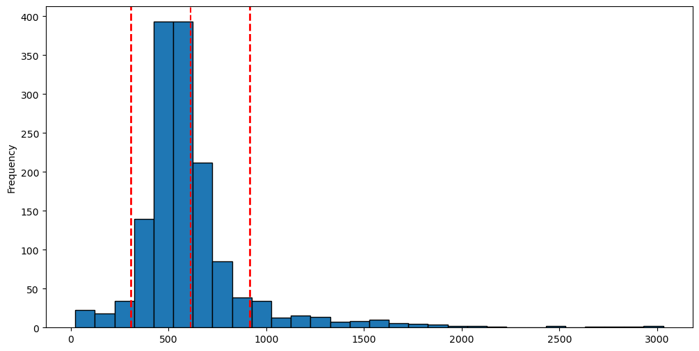

## Generated Data vs Provided Data Length
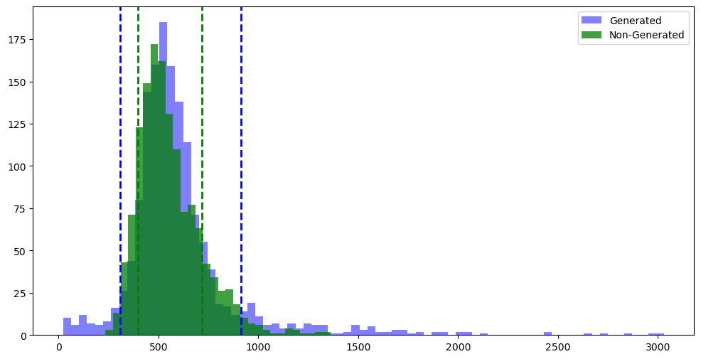

## Generated Data Cleaning

The generated text would consistently include words or phrases that were removed:
- Bibliography, Sources, References
- Introduction:, Conclusion:, Essay Sample, Explanation, Analysis
- Dear/To State Senator, Dear/To Senator
- [Address], [Subject], [City, State Zip Code], [Date]

Student essays included a mix of valedictions or sign-offs, these were randomly added to the AI essays, such as:
- Name
- Anonymous, Anonymous Student, Anonymous Citizen
- American Citizen, Concerned Citizen

Essays that were shorter or longer that the student essays were removed.

## Generated Data vs Provided Data Length After Cleaning
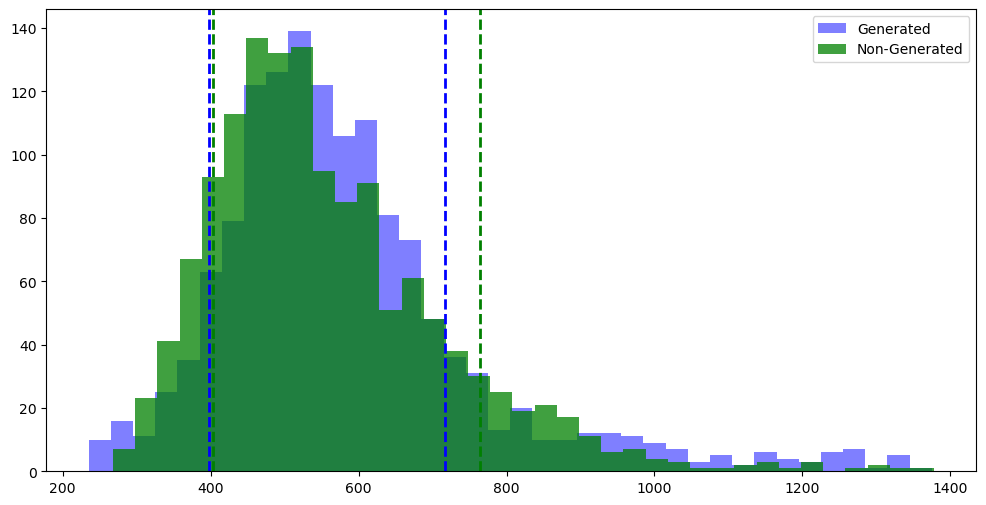

## Word Cloud for 1st Prompt

Student Written

  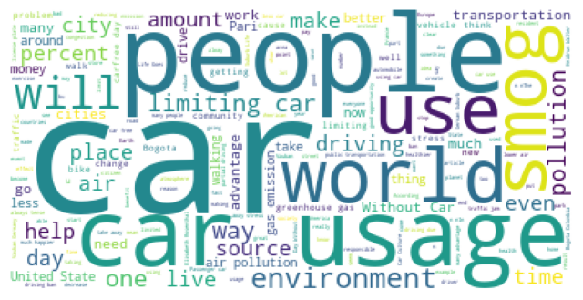

AI Generated

  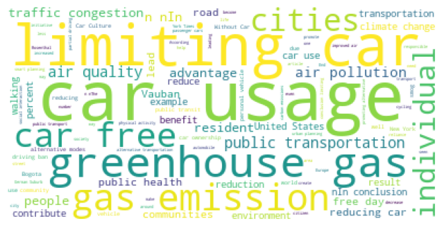

## Word Cloud for 2nd Prompt

Student Written

  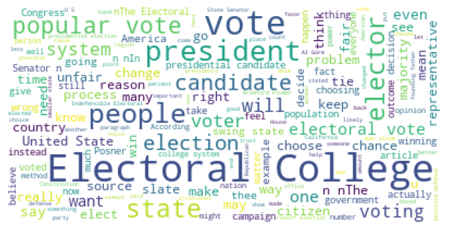

AI Generated

  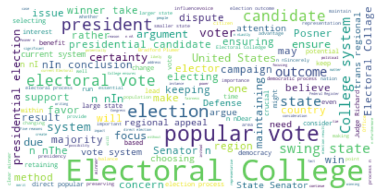

## Unigrams for 1st Prompt

  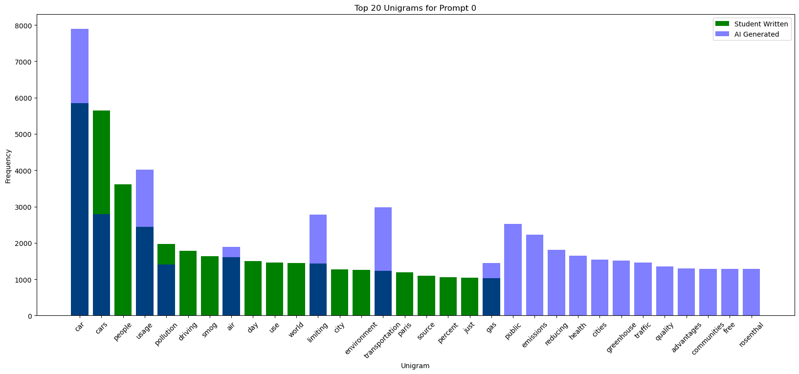

N-grams help capture information like word order, context and meaning, which is useful for natural language processing.

Unigrams look at a single sequence. The darker blue color implies overlap between the student-written and ai-generated essays.

## Trigrams for 1st Prompt

  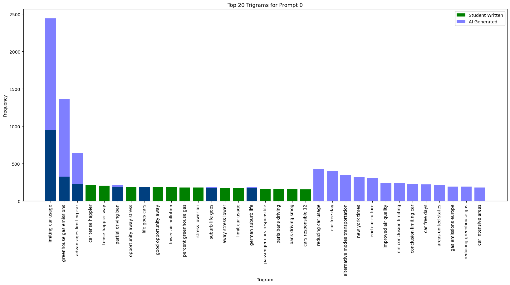

## Unigrams for 2nd Prompt

  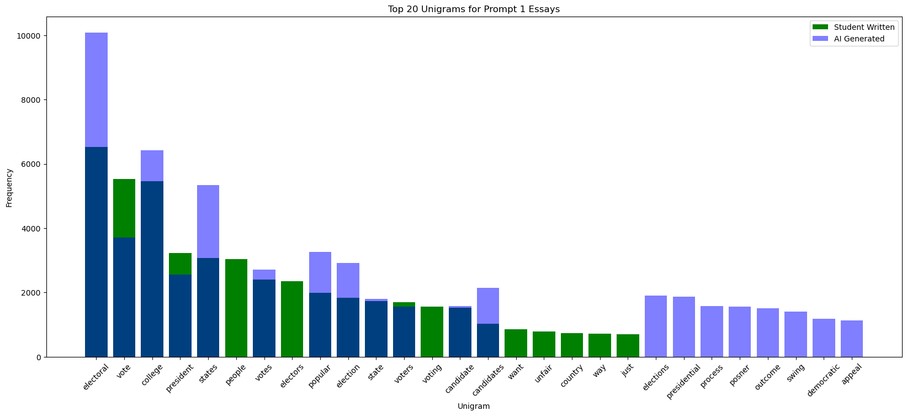

## Trigrams for 2nd Prompt

  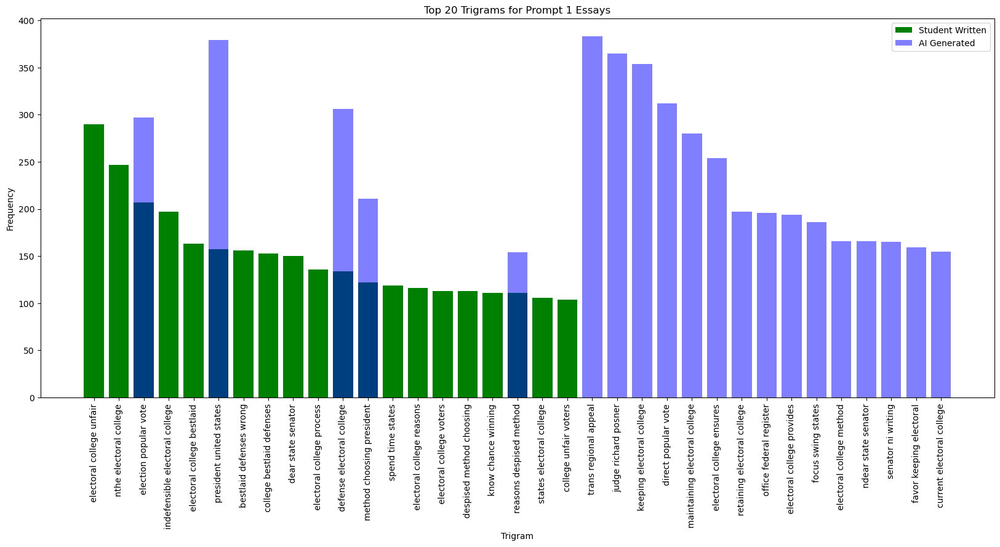

## Additional Data Needed
Training on just 2500 essays for 2 prompts would be insufficient.

“Augmented Data for LLM” provided 433,000 new student and AI generated essays.

The competition-provided essays plus my AI generated essays were now designated as a testing set.

## Text Preparation

Essay text was then vectorized before model training.

This allows the text to be represented numerically, which is required for natural language processing model training.

The entire dataset of vocabulary was placed in a vector database to create a consistent set of vectors.

  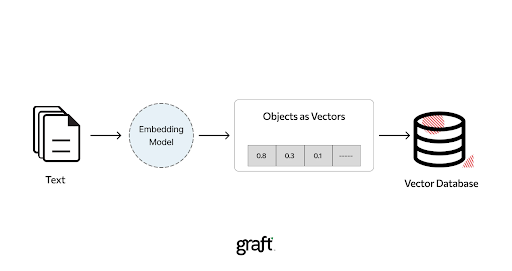

## Model Training

A keras classification model was chosen.

Initial model testing resulted in the following results, tested on data from the augmented-llm-data and on the data provided by the competition.

  

Extra epochs resulted in lower accuracy on the competition test set. For that reason, 3 epochs were chosen.

As the competition also has a 'Training Efficiency' portion, a low train time was preferred and a dim of 64 was chosen.

## Model Training - Layout

  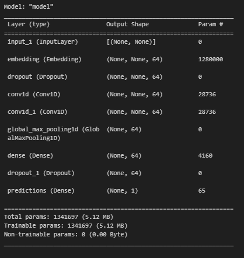

## Model Training

Next, a Perceptron model is used in unison with the keras classification model.

A Perceptron is a type of binary classification algorithm. Its prediction will be combined with the keras model to ultimately determine an answer.

After training, an accuracy of 99% is achieved.

  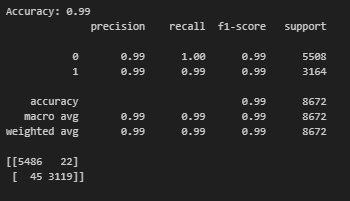

The Keras and Perceptron models are combined into another classifier model that is then retrained on the data, resulting in an accuracy of 99.378%.

Initial testing on 46% of the competition's final test data achieved:
- Accuracy of 85.67% 
- Placed 3053 out of 4359.
Final results on 54% of test data were:
- Accuracy of  74.25%
- Placed 2882 out of 4359.

  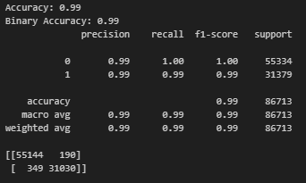

## Future Considerations

Transformers
- Play a huge role in NLP
- Do not rely on sequential connections
- Utilize self-attention mechanisms, allowing long-term contextual information to be retained.
- Would allow a broader understanding of the essay’s overall context.

## Citations

- LLM - Detect AI Generated Text. Kaggle. (n.d.). https://www.kaggle.com/competitions/llm-detect-ai-generated-text/overview
- andrijdavid. (n.d.). Andrijdavid/CATPPT-base-GGUF · hugging face
- TheBloke. (n.d.). TheBloke/dolphin-2.6-mistral-7b-dpo-GGUF · hugging face
- TheBloke. (n.d.). TheBloke/Mistral-7B-Instruct-v0.2-GGUF · hugging face
- Herrera, J. (2023, November 21). Augmented data for LLM - detect AI generated text. Kaggle. https://www.kaggle.com/datasets/jdragonxherrera/augmented-data-for-llm-detect-ai-generated-text/data
- https://stateimpact.npr.org/florida/files/2014/03/3-21-WritingTest.jpg
- We Used A.I. to Write Essays for Harvard, Yale and Princeton. Here’s How It Went. - The New York Times (nytimes.com)
- https://assets-global.website-files.com/640248e1fd70b63c09bd3d09/64ff91994b8f87cabbd254cc_vector_database.webp
